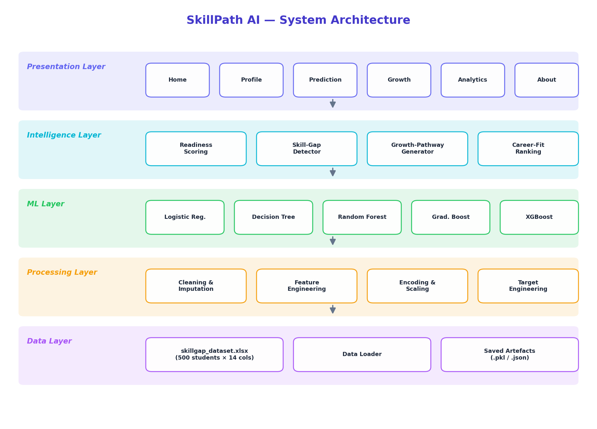
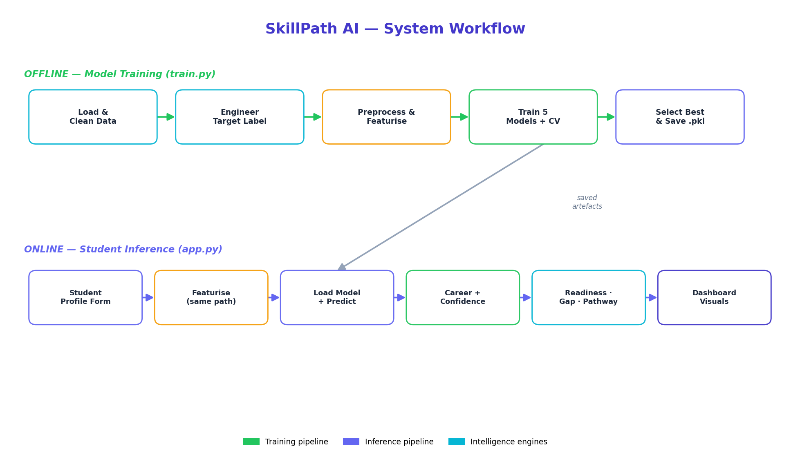

<div align="center">

# 🎯 SkillPath AI
### Intelligent Skill Profiling for Career Readiness & Growth Pathways

*Analyse student skills → predict the best-fit career → uncover skill gaps → generate a personalised growth roadmap — powered by Machine Learning.*


</div>

---

## 📌 Overview

Students often lack clarity about **which career suits them**, **how industry-ready they are**, and **what to learn next**. **SkillPath AI** is an end-to-end machine-learning application that turns a simple student profile into actionable career guidance:

- 🔮 **Career prediction** across **10 in-demand tech roles** with a confidence score
- 📐 A transparent **0–100 Career-Readiness score** (weighted across 5 pillars)
- 🔍 Automated **skill-gap detection** (skills, languages, certifications, projects)
- 🚀 A personalised **growth pathway** — weekly, 30-day and 90-day action plans
- 📊 A rich, interactive **analytics dashboard** (10+ Plotly charts)

> Built as a complete, production-quality reference project: clean modular code, a full ML pipeline, automated model selection, a polished multi-page UI, tests, and deployment guides.

---

## ✨ Key Features

| Area | What you get |
|---|---|
| **ML career prediction** | 5 models trained & compared; best auto-selected via cross-validation and saved with `joblib`. |
| **Readiness scoring** | Custom weighted formula (Technical 40% · Programming 20% · Soft 20% · Projects 10% · Alignment 10%). |
| **Skill-gap engine** | Missing technical/soft skills, languages, certifications & projects + plain-English explanations. |
| **Growth pathway** | Recommended skills, projects, certifications, curated resources, interview prep & time-boxed plans. |
| **Analytics dashboard** | Pie/bar/histogram/heatmap/scatter + live confidence **gauge** & readiness **speedometer**. |
| **Modern UI** | Sidebar navigation, gradient hero, cards, progress meters, **light & dark mode**, responsive layout. |
| **Production hygiene** | Modular `src/` package, fixed train/inference feature parity, AppTest smoke tests, pinned deps. |

---

## 🖼️ Architecture & Workflow

| System Architecture | System Workflow |
|---|---|
|  |  |

See [`docs/ARCHITECTURE.md`](docs/ARCHITECTURE.md) and [`docs/SYSTEM_WORKFLOW.md`](docs/SYSTEM_WORKFLOW.md) for annotated Mermaid versions.

---

## 🚀 Quickstart

```bash
# 1. Clone & enter the project
cd AI_Proj

# 2. (recommended) create a virtual environment
python -m venv venv
# Windows:  venv\Scripts\activate
# macOS/Linux:  source venv/bin/activate

# 3. Install dependencies
pip install -r requirements.txt

# 4. Train the models (creates models/*.pkl — ~1 minute)
python train.py

# 5. Launch the app
streamlit run app.py
```

Then open **http://localhost:8501** in your browser. 🎉

> The app also ships with pre-trained models, so step 4 is optional for a first run.

---

## 🗂️ Project Structure

```
AI_Proj/
├── app.py                     # Streamlit entry point (navigation + sidebar)
├── train.py                   # One-command training pipeline
├── requirements.txt
├── README.md
├── skillgap_dataset.xlsx      # Raw dataset (500 students × 14 columns)
│
├── src/                       # Core ML / domain package
│   ├── config.py              # Single source of truth (careers, weights, resources)
│   ├── data_loader.py         # Load + clean messy headers & multi-value cells
│   ├── preprocessing.py       # Missing/dup/outliers/feature-eng/encoding
│   ├── target_engineering.py  # Expert decision rubric -> ML target label
│   ├── readiness.py           # 0-100 weighted readiness scoring
│   ├── model_training.py      # Train, evaluate, compare & persist 5 models
│   ├── predict.py             # Inference wrapper (train/inference parity)
│   ├── skill_gap.py           # Skill-gap detection & explanations
│   ├── growth_pathway.py      # Personalised roadmap generator
│   ├── eda.py                 # EDA aggregations
│   └── visualizations.py      # Plotly chart factory (gauges, speedometer...)
│
├── app_pages/                 # Streamlit UI pages
│   ├── components.py          # Reusable UI blocks + global CSS
│   ├── home.py · profile.py · prediction.py
│   ├── growth.py · analytics.py · about.py
│
├── models/                    # Saved artefacts (best_model.pkl, metrics.json ...)
├── assets/                    # Generated diagrams
├── scripts/make_diagrams.py   # Architecture/workflow PNG generator
├── tests/test_app.py          # End-to-end AppTest smoke tests
└── docs/                      # Report, PPT content, viva Q&A, deployment ...
```

---

## 📊 Dataset

**Student Skill-Gap Analysis** — 500 student records, 14 raw columns:

`Academic Year · Current Course · Technical Skills · Programming Languages · Technical Skill Rating · Soft Skills · Soft Skill Rating · Projects · Career Interest · Learning Challenges · Support Required · Learning Method`

The loader cleans messy headers (leading spaces, the misspelt `SOFT_SKILSS`, duplicated `RATING.1`), normalises academic-year labels and parses comma-separated skill cells.

---

## 🤖 Machine-Learning Pipeline

1. **Clean** → **Engineer target** → **Preprocess** (impute · dedupe · outliers · feature-engineer) → **Featurise** (54 features) → **Train + CV** → **Select best** → **Save**.
2. The ML target (`recommended_career`) is produced by a transparent **expert decision rubric** (interest → career family → refined by course/skills/ratings) with light label noise, then **learned** by the models so it generalises to new profiles.

### Model comparison (auto-selected by 5-fold CV F1)

| Model | Accuracy | Precision | Recall | F1 | CV-F1 |
|---|:--:|:--:|:--:|:--:|:--:|
| 🏆 **Random Forest** | **0.94** | **0.95** | **0.94** | **0.94** | **0.909** |
| Decision Tree | 0.94 | 0.95 | 0.94 | 0.94 | 0.897 |
| Gradient Boosting | 0.92 | 0.93 | 0.92 | 0.92 | 0.889 |
| XGBoost | 0.90 | 0.91 | 0.90 | 0.90 | 0.881 |
| Logistic Regression | 0.74 | 0.75 | 0.74 | 0.74 | 0.750 |

*Ensembles cluster at the top; the linear model trails because the decision boundary is non-linear — exactly the expected pattern. Macro-F1 = 0.94 across all 10 classes.*

---

## 📐 Career-Readiness Score

```
Readiness (0–100) =  0.40 · Technical   +  0.20 · Programming
                  +  0.20 · Soft Skills +  0.10 · Projects
                  +  0.10 · Career Alignment
```

| Score | Band |
|---|---|
| 0–40 | 🌱 Beginner |
| 41–60 | 📘 Intermediate |
| 61–80 | 🚀 Advanced |
| 81–100 | 🏆 Industry Ready |

---

## 🎯 Career Domains

`Data Scientist` · `Data Analyst` · `AI Engineer` · `Machine Learning Engineer` · `Cloud Engineer` · `DevOps Engineer` · `Cybersecurity Analyst` · `Software Developer` · `Full Stack Developer` · `Business Analyst`

---

## 🧪 Testing

```bash
python tests/test_app.py        # end-to-end smoke tests (all 6 pages + full flow)
# or, if pytest is installed:
pytest tests/test_app.py -v
```

The tests run the entire Streamlit app through Streamlit's `AppTest` harness and assert **zero exceptions** on every page, plus a full profile→prediction→roadmap flow.

---

## ☁️ Deployment

Full step-by-step guides for **Streamlit Community Cloud**, **AWS EC2** and **Google Cloud (App Engine / Cloud Run / VM)** are in [`docs/DEPLOYMENT.md`](docs/DEPLOYMENT.md).

---

## 🛠️ Tech Stack

**Python · Streamlit · scikit-learn · XGBoost · Plotly · Pandas · NumPy · Seaborn/Matplotlib · Joblib**

---

## 📚 Documentation

- 📄 [Project Report](docs/PROJECT_REPORT.md)
- 🎤 [Presentation (PPT) Content](docs/PPT_CONTENT.md)
- ❓ [Viva Questions & Answers](docs/VIVA_QA.md)
- 🏛️ [Architecture](docs/ARCHITECTURE.md) · 🔄 [System Workflow](docs/SYSTEM_WORKFLOW.md)
- ☁️ [Deployment Guide](docs/DEPLOYMENT.md)

---

## ⚠️ Disclaimer

Recommendations are **directional guidance** generated by a model trained on a sample dataset. Use them alongside mentors and your own research — not as a definitive verdict. Built for educational & academic-project use.

## 📝 License

Released under the **MIT License** — free to use, modify and learn from.

<div align="center"><sub>Made with ❤️ using Streamlit, scikit-learn & Plotly.</sub></div>
