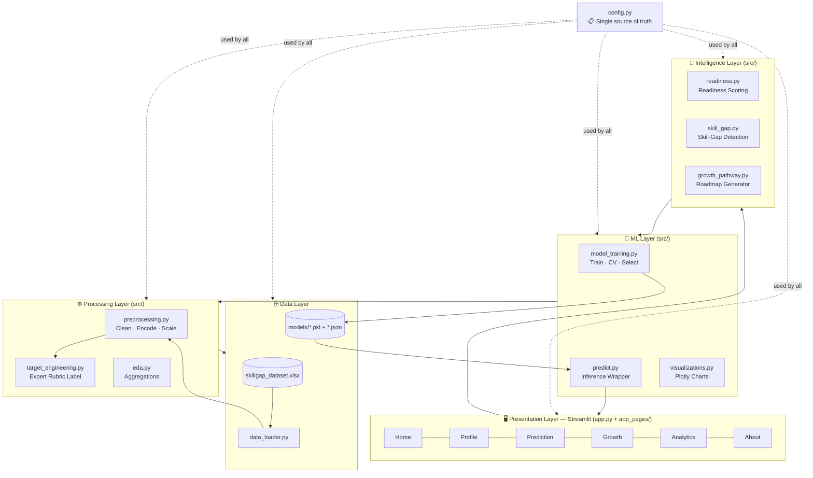

# 🏛️ System Architecture — SkillPath AI

A layered architecture cleanly separates **data**, **processing**, **machine learning**, **domain intelligence** and **presentation**. Each layer depends only on the layer beneath it, which keeps the code testable and the responsibilities obvious.

---

## Layered view (Mermaid)

---

## Layer responsibilities

| Layer | Modules | Responsibility |
|---|---|---|
| **Data** | `data_loader.py`, `skillgap_dataset.xlsx`, `models/` | Load the spreadsheet, clean headers/labels, parse multi-value cells; persist & reload model artefacts. |
| **Processing** | `preprocessing.py`, `target_engineering.py`, `eda.py` | Missing-value handling, duplicate removal, outlier detection, feature engineering, encoding/scaling, target-label creation and EDA aggregation. |
| **ML** | `model_training.py`, `predict.py`, `visualizations.py` | Train/compare 5 models, cross-validate, auto-select, serialise; load model for inference; render Plotly figures. |
| **Intelligence** | `readiness.py`, `skill_gap.py`, `growth_pathway.py` | Deterministic, explainable domain logic: readiness scoring, gap detection, roadmap generation. |
| **Presentation** | `app.py`, `app_pages/*` | Multi-page Streamlit UI, navigation, session state, theming. |
| **Cross-cutting** | `config.py` | Centralised paths, skill catalogues, the 10 career definitions, scoring weights, resources & theme tokens. |

---

## Key design decisions

1. **Train/inference feature parity.** Both training and the live app call the *same* `preprocessing.featurize()` with a fixed, config-driven column order — a single student form row is encoded identically to the training matrix. This eliminates the most common production-ML bug (feature skew).

2. **Explainable target via an expert rubric.** Because the dataset has no ground-truth "best-fit career", `target_engineering.py` encodes a transparent decision rubric (career interest → family → refined by course/skills) and the ML models *learn to generalise* it. Light label noise keeps the task realistic and avoids a misleading 100% score.

3. **Deterministic intelligence on top of ML.** The career *prediction* is ML-driven (with a probability/confidence), while readiness, skill-gap and roadmap are **deterministic** and rule-based — so every number shown to a student is fully explainable.

4. **Graceful degradation.** `predict.py` falls back to the rule-based rubric if model artefacts are missing, and XGBoost is an optional import — the app always runs.

5. **Single source of truth (`config.py`).** Careers, certifications, resources, weights and theme colours live in one place, so the ML pipeline, UI and docs never drift apart.
