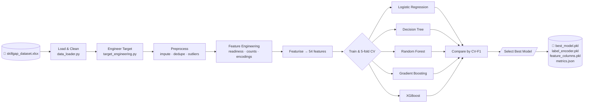
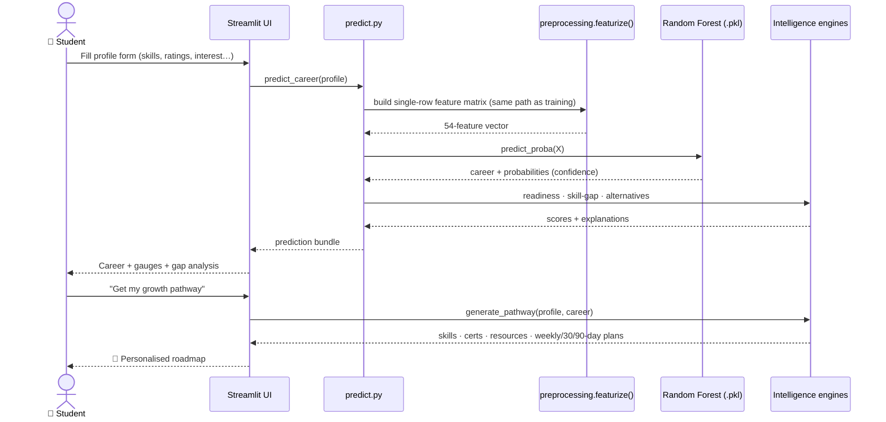
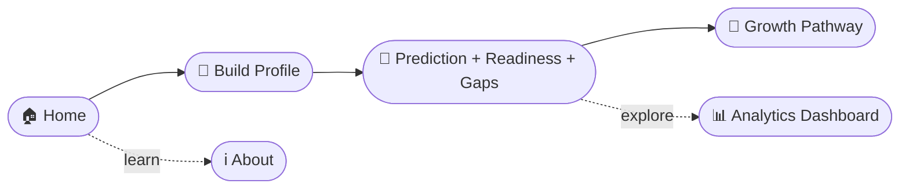

# 🔄 System Workflow — SkillPath AI

The system has two tracks: an **offline training pipeline** (run once via `train.py`) and an **online inference flow** (every time a student uses the app). They meet at the saved model artefacts.

---

## 1. Offline training pipeline (`python train.py`)

**Steps**

1. **Load & clean** the 500-row spreadsheet → canonical columns, normalised years, parsed skill lists.
2. **Engineer the target** `recommended_career` via the expert rubric + seeded label noise.
3. **Preprocess** — impute missing values, drop duplicates, IQR outlier scan.
4. **Feature-engineer** — readiness score, breadth counts, ordinal year, binary flags.
5. **Featurise** — one-hot + multi-hot + numeric → a fixed 54-column matrix.
6. **Train & cross-validate** 5 classifiers (StandardScaler + estimator pipelines).
7. **Select** the highest mean CV-F1 model, **refit** on all data, **serialise** with `joblib`, write `metrics.json` + `metadata.json`.

---

## 2. Online inference flow (`streamlit run app.py`)

---

## 3. User journey

**Typical flow:** Home → build a profile → view the predicted career, readiness speedometer, confidence gauge and skill-gap analysis → open the personalised growth pathway (skills, certifications, resources, interview prep, 30/90-day plans). The Analytics dashboard and About page are available any time from the sidebar.
